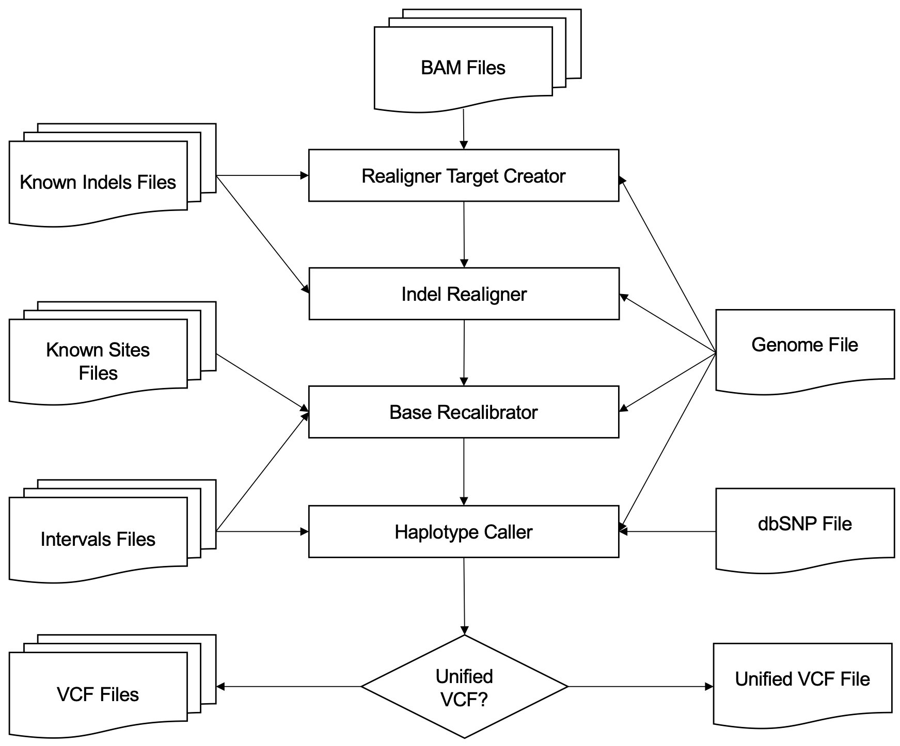

## hpexome: An automated workflow for processing whole-exome sequencing data

Whole-exome sequencing has been widely used in clinical applications for the identification of the genetic causes of several diseases.
_HPexome_ automates many data processing tasks for exome-sequencing data analysis of large-scale cohorts.
Given ready-analysis alignment files it is capable of breaking input data into small genomic regions to efficiently process in parallel on cluster-computing environments.
It relies on Queue workflow execution engine and GATK variant calling tool and its best practices to output high-confident unified variant calling file.
Our workflow is shipped as Python command line tool making it easy to install and use. 

 is a command-line scripting framework for defining multi-stage genomic analysis pipelines combined with an execution manager that runs those pipelines from end-to-end. It has been used to implement workflows for WES data analysis. Our workflow for processing WES data was based on good practices described by authors of GATK software (Van der Auwera et al. 2002). It takes one or more BAM files, reference genome file, known SNP and indels databases, and outputs one or more VCF files.

Our workflow for processing WES data was based on good practices described by authors of GATK software.
It takes one or more ready-abalysis BAM files, reference genome file, known SNP and _indels_ databases, and outputs one or more VCF files.



We used [GATK-Queue](http://gatkforums.broadinstitute.org/gatk/discussion/1306/overview-of-queue) workflow management to implement the workflow.
It consists in a QScript file written in Scala programming language.
The input parameters from every walker are set to default values but user can change theses values through the R interface.
Script is available at <https://github.com/labbcb/hpexome/blob/master/hpexome/Hpexome.scala>.

## Installation

We provide a Python wrapper as command line tool for executing hpexome script.
If not found this tool will download the latest version of Queue.
To install our wrapper you must have installed Python 3 and pip.

``` bash
pip install hpexome
```

## Usage

``` bash
hpexome [OPTIONS] [DESTINATION]
```

OPTIONS:

__Required arguments__

- `-I, --bam` One or more sequence alignment files in BAM format _or_ directories containing `*.bam` files.
- `-R, --genome` Reference genome in single FASTA file.
- `--dbsnp` dbSNP file in VCF format. See [dbSNP FTP](ftp://ftp.ncbi.nih.gov/snp/).
- `--sites` VCF files containing known polymorphic sites to skip over in the recalibration algorithm.

__Optional arguments__

- `--indels` Inputs the VCF file with known insertions and deletions (indels) to be used.
- `-L, --intervals` One or more genomic intervals over which to operate.
- `--unified_vcf` Unify VCF files into a single one.
- `-O, --output_file_name` Output file name for unified VCF. Default is `unified.vcf`.
- `--min_prunning` Minimum support to not prune paths in the graph. Default value is `2`.
- `-stand_call_conf` Minimum phred-scaled confidence threshold at which variants should be called. Default is `30`.

__Performance-specific arguments__

- `-nt, --num_data_threads` Controls the number of data consecutive threads sent to the processor that are used in the parallelization process. It is used in the Realigner Target Creator, and may not be used together with the scattercount option. If not set, the walker will run in serial.
- `-nct, --num_threads_per_data_thread` Controls the number of CPU threads allocated to each data thread. It is used with the Base Recalibrator and the Print Reads, and may not be used together with the `scattercount` option. If not set, the walkers will run in serial.
- ` --job_runner` Job executor engine (eg. Lsf706, Grid, PbsEngine).
- `--scatter_count` Controls the number of parts in which the genetic sequence will be divided when sent to be parallelized by the Job executor engine. It  is used in all walkers. It must be used with the `-jobRuner`  option, or else it will not use the GridEngine and the process will be run in serial.

__System path to required software__

- `--java_path` Path to java. Use this to pass JVM-specific arguments. Default is `java`.
- `--queue_path` Path to Queue jar file. Default is `Queue.jar`.

`DESTINATION` Sets the directory in which the outputs will be saved. If not set, the outputs will be saved in the directory in which the process is running.

The following command line takes a list of ready-analysis BAM files stored in `alignment_files` directory and reference genomes files (version b37).
Then it breaks input data into smaller parts (`--scatter_count 16`) and submits to SGE batch system (`--job_runner PbsEngine`).
All samples will be merged into a single VCF files (`--unified_vcf`) and output files will be written in `result_files` directory.

```bash
hpexome \
    --bam alignment_files \
    --genome references/b37/human_g1k_v37_decoy.fasta  \
    --dbsnp references/b37/dbsnp_138.b37.vcf \
    --indels references/b37/Mills_and_1000G_gold_standard.indels.b37.vcf \
    --indels references/b37/1000G_phase1.indels.b37.vcf \
    --sites references/b37/1000G_phase1.snps.high_confidence.b37.vcf \
    --sites references/b37/1000G_omni2.5.b37.vcf \
    --unified_vcf \
    --scatter_count 16 \
    --job_runner GridEngine \
    result_files
```

## References

__From FastQ Data to High-Confidence Variant Calls: The Genome Analysis Toolkit Best Practices Pipeline__ Van der Auwera GA, Carneiro M, Hartl C, Poplin R, del Angel G, Levy-Moonshine A, Jordan T, Shakir K, Roazen D, Thibault J, Banks E, Garimella K, Altshuler D, Gabriel S, DePristo M, 2013 _CURRENT PROTOCOLS IN BIOINFORMATICS 43:11.10.1-11.10.33_. [Article](http://dx.doi.org/10.1002/0471250953.bi1110s43)
